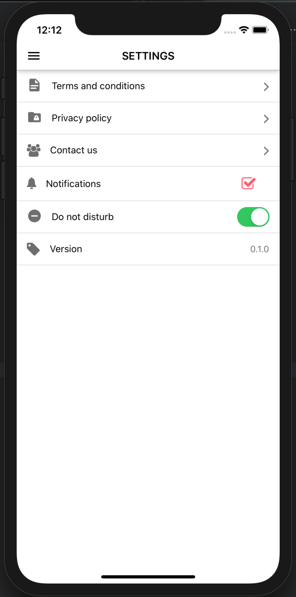

# react-native-settings-view
[NPM Package](https://www.npmjs.com/package/react-native-settings-view)

An easy and highly customizable React Native components to create a complete settings view

</img>

## Getting started

- `yarn add react-native-settings-view`
- `npm install react-native-settings-view`

### Usage

Below is a sample usage of this package

```jsx
import React from 'react';
import { SectionRow, SettingsPage, NavigateRow, BaseRow } from 'react-native-settings-view';

<SettingsPage>
  <SectionRow title="Section one">
    <NavigateRow
      text="Terms and conditions"
      leftIcon={{
        name: 'file-document',
        type: 'material-community',
      }}
      onPress={() => console.log('terms')}
    />
    <NavigateRow
      text="Privacy Policy"
      leftIcon={{
        name: 'folder-lock',
        type: 'material-community',
      }}
      onPress={() => console.log('policy')}
    />
    <NavigateRow
      text="Contact us"
      leftIcon={{
        name: 'users',
        type: 'font-awesome',
      }}
      onPress={() => console.log('contact')}
    />
    <CheckRow
      text="Notifications"
      checked
      leftIcon={{
        name: 'ios-notifications',
        type: 'ionicon',
      }}
      onValueChange={(isChecked) => console.log('checked', isChecked)}
    />
    <SwitchRow
      text="Do not disturb"
      enabled
      leftIcon={{
        name: 'do-not-disturb',
        type: 'material-community',
      }}
      onValueChange={(isEnabled) => console.log('checked', isEnabled)}
    />
    <BaseRow
      text={i18n.t('version')}
      leftIcon={{
        name: 'tag',
        type: 'font-awesome',
      }}
      rightContent={<Text>0.1.0</Text>}
    />
  </SectionRow>
</SettingsPage>
```

### License

This project is licensed under the MIT License - see the [LICENSE](LICENSE) file for details.
